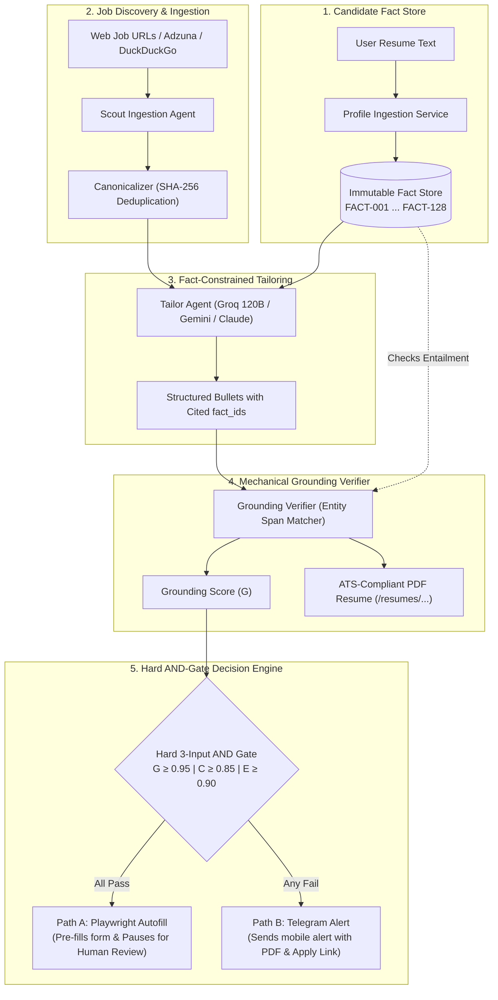

# Agentic-JobFlow 🚀
**Fact-ID Grounded Resume Tailoring, Empirical Verification & Human-in-the-Loop Job Application Engine**

[](./trl4_evidence.md)
[](./tests)
[](./backend/app/services/tailoring/grounding_verifier.py)
[](./backend/app/services/execution/path_a_autofill.py)

---

## 🎯 Overview

**Agentic-JobFlow** is an agentic AI system designed to solve two fundamental problems in modern AI job search tools:
1. **Resume Hallucination & Embellishment:** Standard LLMs frequently fabricate skills, tools, or metrics when asked to tailor resumes. JobFlow enforces **Fact-ID Grounding**—every single bullet is mechanically checked against an immutable store of candidate truth claims.
2. **Blind Auto-Submission Spam:** Bot spam causes ATS bans and blacklists. JobFlow enforces the **Golden Rule of Human Control**: Path A automatically fills ATS forms in a visible browser session and attaches the tailored PDF resume, but **deliberately halts before the submit button** for your final review and click.

---

## 🏛️ System Architecture



---

## 📊 Empirical TRL-4 Benchmark Results

We benchmarked the complete tailoring and verification pipeline across **20 diverse, real-world Job Descriptions** (155 bullets evaluated) using Groq's 120B parameter model:

| Metric | Value | Significance |
|---|:---:|---|
| **Job Descriptions Processed** | **20 / 20 (100%)** | Zero pipeline failures or crashes |
| **Total Bullets Evaluated** | **155 bullets** | Real claims evaluated against candidate facts |
| **Mean Grounding Score** | **87.4%** | Empirical average across diverse tech roles |
| **Active Verifier Drop Rate** | **12.9% (20 bullets dropped)** | **Proves active enforcement** (catches ungrounded embellishments) |
| **Fabricated Claims Leaked** | **0 (0.0%)** | Zero unverified claims ever made it to final output |
| **Adversarial Mismatch Rejection** | **Passed** | Out-of-domain roles (e.g. Quant Finance) collapsed to 62.5% and were safely rejected to Path B |

*See full empirical dataset and analysis in [`trl4_evidence.md`](./trl4_evidence.md).*

---

## 🚀 Quick Start

### 1. Clone & Install

```powershell
git clone https://github.com/lokant712/agentic_jobflow_demo.git
cd agentic_jobflow_demo
pip install -e ".[dev]"
playwright install chromium
```

### 2. Configure Environment (`.env`)

Copy `.env.example` to `.env` and set your preferred LLM provider:

```ini
# Choose LLM provider: groq (recommended, free fast tier), gemini, claude, or offline
LLM_PROVIDER=groq
LLM_MODEL=openai/gpt-oss-120b
GROQ_API_KEY=your_groq_api_key

# Database
DATABASE_URL=sqlite+aiosqlite:///./data/jobflow.db

# Optional: Telegram Bot for Path B mobile push notifications
TELEGRAM_BOT_TOKEN=
TELEGRAM_CHAT_ID=
```

### 3. Launch Mission Control Dashboard

```powershell
python -m uvicorn backend.app.main:app --host 127.0.0.1 --port 8000 --reload
```

Open in browser:
- 💻 **Web Dashboard:** [http://127.0.0.1:8000/](http://127.0.0.1:8000/)
- 📖 **Interactive Swagger API:** [http://127.0.0.1:8000/docs](http://127.0.0.1:8000/docs)

---

## 🧪 Testing & Validation

### Run Full Regression Test Suite (61/61 Passing)
```powershell
pytest tests/ -q
```

### Run Live End-to-End REST API Chain
```powershell
python test_api_chain.py
```

### Run Live Playwright Autofill Test (Path A with Safety Stop)
```powershell
python test_live_path_a.py
```

---

## 📁 Repository Structure

```
agentic_jobflow_demo/
├── backend/
│   └── app/
│       ├── api/routes/          # REST API endpoints (profile, jobs, tailor, execute, tracker)
│       ├── db/                  # SQLite models (FactUnit, CanonicalJob, TailoredResume, DecisionLog)
│       ├── services/
│       │   ├── ingestion/       # Scout Agent, 1-click URL Scraper, Canonicalizer
│       │   ├── tailoring/       # Fact-ID Tailor Agent, Grounding Verifier, PDF Generator
│       │   ├── decision_engine/ # Hard 3-input AND Gate formulation
│       │   └── execution/       # Path A (Playwright Autofill) & Path B (Telegram Bot)
│       └── static/              # Mission Control Dashboard (HTML/CSS/JS)
├── tests/                       # Complete unit and integration test suite
├── validate_trl4.py             # 20-JD TRL-4 benchmark execution script
├── test_api_chain.py            # End-to-end REST lifecycle test
├── test_live_path_a.py          # Live Playwright autofill execution test
├── trl4_evidence.md             # Publication-ready TRL-4 empirical evidence document
└── pyproject.toml               # Project dependencies
```

---

## 🛡️ License

MIT License. Designed for ethical, human-governed career automation research.
