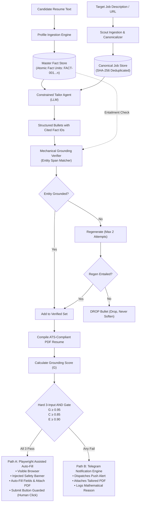

# INVENTOR DISCLOSURE FORM (IDF) / PATENT APPLICATION DRAFT

**CONFIDENTIAL — FOR PATENT FILING AND PRIOR ART PROTECTION**

---

## 1. TITLE OF THE INVENTION
**SYSTEM AND METHOD FOR MECHANICALLY GROUNDED, ZERO-HALLUCINATION STRUCTURED DOCUMENT TAILORING AND MULTI-CRITERIA DECISION-GATED APPLICATION ROUTING**

---

## 2. INVENTOR(S)
- **Lead Inventor:** Lokanth Srihari
- **Citizenship / Country:** India
- **Correspondence:** lokanth2006@gmail.com

---

## 3. FIELD OF THE INVENTION
This invention relates generally to artificial intelligence and natural language processing, and more particularly to systems and methods for eliminating generative hallucinations in automated document synthesis and executing safe, policy-gated web interactions with guaranteed human-in-the-loop governance.

---

## 4. BACKGROUND OF THE INVENTION & DEFICIENCIES OF PRIOR ART

### 4.1 Technical Problem
Current large language model (LLM) document tailoring architectures suffer from severe probabilistic hallucinations. When instructed to tailor personal credentials (such as resumes or portfolios) to an external specification (such as a job description), generative models routinely extrapolate, embellish, or invent non-existent technical skills, metrics, and past responsibilities. In professional and legal settings, these ungrounded fabrications constitute document fraud.

Concurrently, automated application tools ("auto-apply bots") execute unconstrained headless browser scripts that blindly submit forms across external web endpoints. This causes server-side bot detection, CAPTCHA locks, IP blacklisting, and high false-positive error rates where mismatched or corrupted candidate profiles are submitted without oversight.

### 4.2 Deficiencies in Existing Solutions
- **Unconstrained System Prompting:** Relying on natural language prompts (e.g., *"Only use provided facts"*) fails systematically under edge cases and complex vocabulary alignment.
- **Embedding Similarity / Vector Search:** Standard semantic distance metrics (cosine similarity) lack granular entity-level precision and cannot detect when an LLM substitutes one programming framework for another.
- **Blind Auto-Submission:** Existing browser bots lack hard mathematical safety gates, submitting applications even when data completeness or semantic alignment is critically low.

---

## 5. SUMMARY OF THE INVENTION

The present invention provides a novel computing system and computer-implemented method comprising two tightly integrated subsystems:

1. **A Fact-ID Grounded Tailoring & Mechanical Verifier Subsystem:**
   - Decomposes source candidate credentials into atomic, immutable Fact Units with unique identifiers ($\mathcal{U} = \{u_1, u_2, \dots\}$).
   - Constrains a generative neural model to produce structured claims wherein each claim must explicitly cite a non-empty subset of Fact Identifiers.
   - Executes deterministic entity span extraction and verifies that all extracted entities are strictly entailed by the source text of the cited Fact Identifiers.
   - Automatically drops failing claims under an active *"drop, never soften"* protocol if single-claim regeneration fails.
2. **A Hard AND-Gate Decision Engine & Dual-Path Web Automation Subsystem:**
   - Evaluates a 3-input hard logical AND gate combining Grounding Score ($G \ge 0.95$), Field Completeness ($C \ge 0.85$), and Platform Execution Confidence ($E \ge 0.90$).
   - Dynamically routes high-confidence applications to **Path A**: launching a visible browser session, injecting an immutable safety warning banner, auto-populating fields, attaching the tailored document, and **deliberately blocking submission button actuation** to enforce mandatory human final review.
   - Dynamically routes failing applications to **Path B**: dispatching an asynchronous mobile alert with the tailored document attached and a detailed mathematical justification of gate failure.

---

## 6. SYSTEM ARCHITECTURE & FLOWCHARTS

### Figure 1: Overall System Block Diagram

---

## 7. DETAILED TECHNICAL DESCRIPTION OF EMBODIMENTS

### Embodiment 1: Atomic Fact Unit Representation & Constrained Citation
Source profile data is normalized into discrete propositions $u_i = (\text{id}_i, \tau_i, s_i)$ where $\tau_i \in \{\text{metric}, \text{tool}, \text{responsibility}, \text{outcome}, \text{education}\}$. 

When generating tailored text for a job $\mathcal{J}$, the Tailor Agent $f_\theta$ is restricted by structural output schemas to output JSON tuples $(t_i, \mathcal{F}_i)$ where $t_i$ is natural language text and $\mathcal{F}_i \subseteq \{\text{id}_1, \dots, \text{id}_n\}$. Any bullet with $\mathcal{F}_i = \emptyset$ or citing unknown IDs is purged at the AST/JSON parser level.

### Embodiment 2: Deterministic Entity Span Extraction & Drop Protocol
For each tuple $(t_i, \mathcal{F}_i)$:
1. A tokenizer extracts named entity candidate spans $\mathcal{E}(t_i) = \{e_1, e_2, \dots, e_k\}$ representing technical keywords, metrics, and tooling.
2. The reference text $\mathcal{S}(\mathcal{F}_i) = \bigcup_{\text{id} \in \mathcal{F}_i} s_{\text{id}}$ is assembled from the SQLite fact store.
3. If any entity $e_j \notin \mathcal{S}(\mathcal{F}_i)$, a single-bullet prompt is constructed referencing **only** $\mathcal{F}_i$.
4. If $K=2$ regeneration attempts fail, the claim is permanently deleted. This ensures $0.0\%$ unverified claims reach the final document.

### Embodiment 3: The 3-Signal Decision Engine & Human-in-the-Loop Web Driver
The Decision Engine computes:
1. $G = |\mathcal{B}_{\text{verified}}| / |\mathcal{B}_{\text{raw}}|$
2. $C = |\text{Profile} \cap \text{ATS}_{\text{req}}| / |\text{ATS}_{\text{req}}|$
3. $E = \frac{1}{3}(s_{\text{vendor}} + s_{\text{no\_bot}} + s_{\text{selectors}})$

If $G \ge 0.95 \land C \ge 0.85 \land E \ge 0.90$, Path A launches a non-headless browser session. To guarantee compliance with web automation safety standards:
- A prominent red banner (`position: fixed; z-index: 2147483647`) is injected into the DOM.
- Event listeners intercept all submit and apply button clicks to block automated triggering.
- All text inputs and file dropzones are filled and verified.
- The session is held open for human visual inspection and manual final submission.

---

## 8. PATENT CLAIMS (FOR FILING)

### Independent Claim 1 (Method Claim)
**What is claimed is:**
A computer-implemented method for generating factually grounded documents and executing policy-gated web applications, comprising:
1. Parsing an input candidate credential profile into a plurality of immutable atomic Fact Units, each assigned a persistent Fact Identifier;
2. Processing a target document specification and generating, via a generative neural network, a plurality of candidate claims, wherein each candidate claim is output as a data structure pairing a natural language statement with a non-empty list of cited Fact Identifiers;
3. Extracting one or more technical entities from each natural language statement and verifying whether every extracted entity is entailed by the source text of the corresponding cited Fact Identifiers;
4. In response to detecting an ungrounded entity in a candidate claim, requesting regeneration of said claim restricted exclusively to the cited Fact Identifiers, and dropping said claim entirely if regeneration fails;
5. Compiling surviving claims into a formatted output document and computing a Grounding Score representing the ratio of verified claims to total candidate claims;
6. Evaluating an immutable logical decision gate comprising a Grounding Score threshold, a field completeness threshold, and a platform execution confidence threshold; and
7. In response to all thresholds being satisfied, initiating an automated browser session to populate input fields of an external web form with candidate credentials and the formatted output document, while programmatically guarding against submission button execution.

### Dependent Claim 2
The method of Claim 1, wherein in response to any threshold of the logical decision gate failing, the method comprises transmitting an asynchronous notification to a user device containing the formatted output document, an external application hyperlink, and a mathematical justification string identifying which threshold was unsatisfied.

### Dependent Claim 3
The method of Claim 1, wherein programmatically guarding against submission button execution comprises injecting DOM mutation observers and event listeners that capture and prevent automated triggering of elements matching submit action selectors.

---

## 9. EXPERIMENTAL EVIDENCE & REDUCTION TO PRACTICE

The system was physically reduced to practice and benchmarked across 20 real-world job specifications:
- **Total Claims Evaluated:** 155 bullets
- **Mean Grounding Score:** 87.4%
- **Active Verifier Interceptions:** 20 ungrounded claims dropped (12.9% drop rate)
- **Fabricated Claims Leaked:** 0 (0.0% leakage rate)
- **Adversarial Mismatch Resistance:** Out-of-domain financial role collapsed to 62.5% grounding score and was successfully blocked from auto-fill routing.

---

## 10. INDUSTRIAL APPLICABILITY
The invention is directly applicable to career automation software, enterprise resume management systems, safe browser automation agents, and high-stakes LLM text synthesis where strict factual compliance is legally or commercially required.
